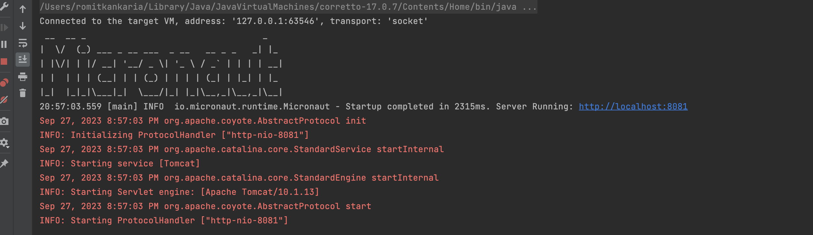

## Fetch Receipts Service

## Requirements and setup for the project:

This project uses Micronaut 4.1.2, a microservice framework in Java v17. There are some documentation links attached below. It makes use of a Tomcat 9.0 server.

The java jdk we are using is Amazons corretto 17. Please install this version from the link below:
   - [https://docs.aws.amazon.com/corretto/latest/corretto-17-ug/what-is-corretto-17.html](https://docs.aws.amazon.com/corretto/latest/corretto-17-ug/macos-install.html).
   - https://docs.aws.amazon.com/corretto/latest/corretto-17-ug/generic-linux-install.html
   - https://docs.aws.amazon.com/corretto/latest/corretto-17-ug/windows-7-install.html
     
There are two ways to setup the project.

First one involves Docker. The steps are as follows:

1. Docker is required if we do not want to set up Java v17 and tomcat locally. 
   In order to install docker, follow the steps:
     - For MacOS: https://docs.docker.com/desktop/install/mac-install/
     - Windows: https://docs.docker.com/desktop/install/windows-install/
     - Linux: https://docs.docker.com/desktop/install/linux-install/
2. Post the successful installation of Docker and Docker desktop,
     - try to run **docker -v** to check its successful installation.
3. This project is built using Gradle and requires presence of Gradle version 8+. 
     - To install gradle on macOS, we can either use:
       - brew install gradle
       - sdk install gradle 8.3. This requires installing: https://sdkman.io/
       - In case you get stuck, navigate to https://gradle.org/install/
4. Post the successful installation, check **./gradlew -v** to check the gradle version
5. After this, run the following steps:
      - `./gradlew dockerBuild`
      - `docker run fetch-receipts-service:latest`
6. In case, for M1 users this does not work. Then, go on to run the following commands:
      - `./gradlew dockerBuild`
      - `docker build --platform linux/amd64 -t fetch-receipts-m1-amd:latest ./build/docker/main -f ./build/docker/main/Dockerfile`
      - `docker run --platform linux/amd64 fetch-receipts-m1-amd:latest`

The other method involves:

2. This project is built using Gradle and requires presence of Gradle version 8+. 
     - To install gradle, navigate to https://gradle.org/install/
3. Post the successful installation, check **./gradlew -v** to check the gradle version
4. To compile and run, use the following commands:
      - ` ./gradlew compileJava`
      - `./gradlew run`

The application will be up on http://localhost:8081 and you would see the following screen.



---
## Summary of API Specification

All routes have a base-url /fetch.
In order to test the APIs, we can either use cURL or Postman. 

### Endpoint: Process Receipts

* Path: `/receipts/process`
* Method: `POST`
* Payload: Receipt JSON
* Response: JSON containing an id for the receipt.

Description:

Takes in a JSON receipt (see example in the example directory) and returns a JSON object with an ID generated by your code.

Example Request:
```json
{
  "retailer": "Target",
  "purchaseDate": "2022-01-01",
  "purchaseTime": "13:01",
  "items": [
    {
      "shortDescription": "Mountain Dew 12PK",
      "price": "6.49"
    },{
      "shortDescription": "Emils Cheese Pizza",
      "price": "12.25"
    },{
      "shortDescription": "Knorr Creamy Chicken",
      "price": "1.26"
    },{
      "shortDescription": "Doritos Nacho Cheese",
      "price": "3.35"
    },{
      "shortDescription": "   Klarbrunn 12-PK 12 FL OZ  ",
      "price": "12.00"
    }
  ],
  "total": "35.35"
}
```

Example Response:
```json
{ "id": "7fb1377b-b223-49d9-a31a-5a02701dd310" }
```

## Endpoint: Get Points

* Path: `/receipts/{id}/points`
* Method: `GET`
* Response: A JSON object containing the number of points awarded.

Example Response:
```json
{ "points": 32 }
```

---

In order to test using cURL, 

For POST: ``` /receipts/process```
```http request
curl --header "Content-Type: application/json" \
        --request POST \
        --data '{
  "retailer": "Target",
  "purchaseDate": "2022-01-01",
  "purchaseTime": "13:01",
  "items": [
    {
      "shortDescription": "Mountain Dew 12PK",
      "price": "6.49"
    },{
      "shortDescription": "Emils Cheese Pizza",
      "price": "12.25"
    },{
      "shortDescription": "Knorr Creamy Chicken",
      "price": "1.26"
    },{
      "shortDescription": "Doritos Nacho Cheese",
      "price": "3.35"
    },{
      "shortDescription": "   Klarbrunn 12-PK 12 FL OZ  ",
      "price": "12.00"
    }
  ],
  "total": "35.35"}' \
  http://localhost:8081/fetch/receipts/process
```


For GET: ``` /receipts/{id}/points```

Replace the ID with the ID generated with the POST request:

```http request
curl http://localhost:8081/fetch/receipts/{id}/points 
```


I have made use of the DTO record and Controller patterns for this application. 
Exception Handlers have been created for appropriate status codes. 
I have ensured that all validations are done before an object is created an stored in the map. This map could be replaced by an im-memory caffeine cache as well. 

For detailed documentation of micronaut, refer to links below.


- [User Guide](https://docs.micronaut.io/4.1.2/guide/index.html)
- [API Reference](https://docs.micronaut.io/4.1.2/api/index.html)
- [Configuration Reference](https://docs.micronaut.io/4.1.2/guide/configurationreference.html)
- [Micronaut Guides](https://guides.micronaut.io/index.html)

---

- [Shadow Gradle Plugin](https://plugins.gradle.org/plugin/com.github.johnrengelman.shadow)
- [Micronaut Gradle Plugin documentation](https://micronaut-projects.github.io/micronaut-gradle-plugin/latest/)
- [GraalVM Gradle Plugin documentation](https://graalvm.github.io/native-build-tools/latest/gradle-plugin.html)

## Feature validation documentation

- [Micronaut Validation documentation](https://micronaut-projects.github.io/micronaut-validation/latest/guide/)

## Feature reactor documentation

- [Micronaut Reactor documentation](https://micronaut-projects.github.io/micronaut-reactor/snapshot/guide/index.html)

## Feature cache-caffeine documentation

- [Micronaut Caffeine Cache documentation](https://micronaut-projects.github.io/micronaut-cache/latest/guide/index.html)

- [https://github.com/ben-manes/caffeine](https://github.com/ben-manes/caffeine)

## Feature tomcat-server documentation

- [Micronaut Tomcat Server documentation](https://micronaut-projects.github.io/micronaut-servlet/1.0.x/guide/index.html#tomcat)

## Feature micronaut-aot documentation

- [Micronaut AOT documentation](https://micronaut-projects.github.io/micronaut-aot/latest/guide/)

## Feature serialization-jackson documentation

- [Micronaut Serialization Jackson Core documentation](https://micronaut-projects.github.io/micronaut-serialization/latest/guide/)

## Feature openapi documentation

- [Micronaut OpenAPI Support documentation](https://micronaut-projects.github.io/micronaut-openapi/latest/guide/index.html)

- [https://www.openapis.org](https://www.openapis.org)


